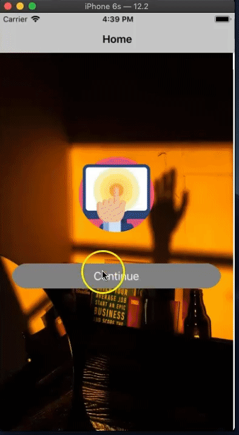
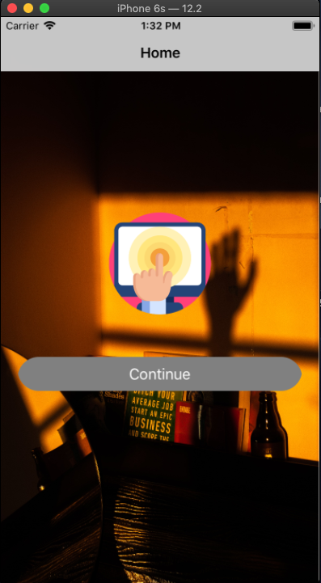
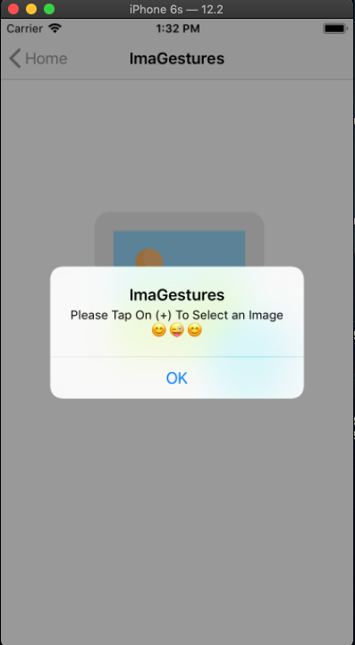
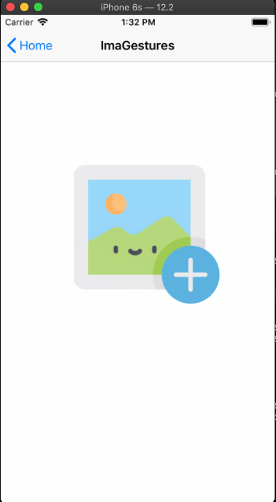
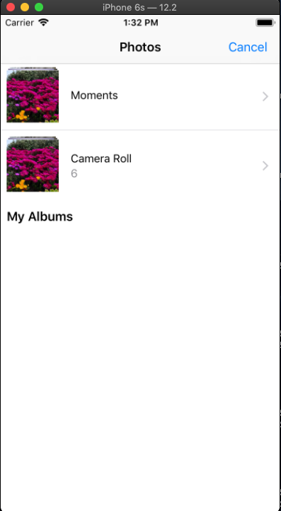
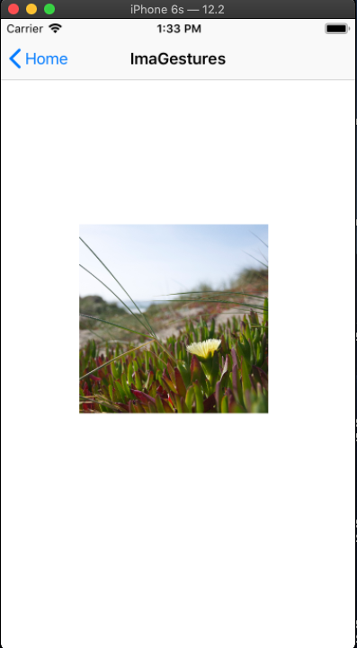
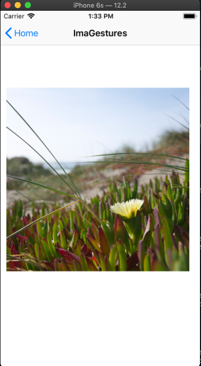
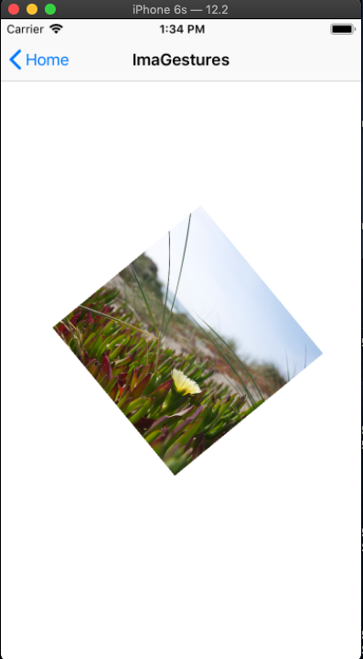

# ImaGestures
 Simple App that Contain Gestures like Tap,Pinch,Rotation,Swipe,Pan

#### UIElements
 
 - UILabel
 - UIButton
 - UIImageView
 - UIImagePicker
 - UIAlertView
 
 ## How ImaGastures Work
 
 - Click On Imagestures To see Full Demo
 
 

 - Short Hand Demo
 
 
 
 ### Output
 
  - Home

 - Notice

 - ImaGestures : On Tap - Open Image Picker

 - ImaGestures : Image Picker

 - ImaGestures : On Pinch - Scale the Image View

- ImaGestures : On Pinch - Scale the Image View

- ImaGestures : On Rotation - Rotate the Image View

#### Step to Installation
 
 - Dawnload The Project
 - Make Folder ImaGestures
 - Paste the Dawnloaded Folder Into It
 - Cut the Image Picker App.xcodeproj file and Paste in ImaGestures
 

